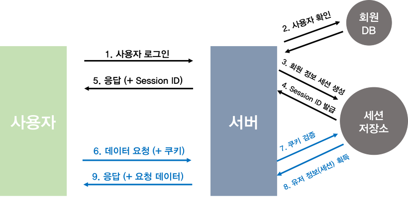

# Research
서비스 내 사용자 인증(인증 관련 토큰, 해싱) = **"서버 인증"**
[*참고자료*](https://tansfil.tistory.com/58)

## 인증이 필요한 이유
- **프론트엔드 관점 인증이란**
    - 사용자의 로그인, 회원가입과 같은 도입 부분
- **서버사이드 관점 인증이란**
    - 모든 API 요청에 대해 사용자를 확인하는 작업
    - ~~사용자가 누군지 알아야 그에 맞는 데이터를 보내주고 등등... 당연~~
- **HTTP 요청**
    - 현재 모바일이나 웹 서비스에서 가장 많이 쓰이는 통신 방식
    - **구조**
        - |요청 라인|
          |----|
          |헤더|
          |공백|
          |바디|
    - 일반적으로 헤더와 바디 두가지로 구성되며, 공백은 헤더와 바디를 구분짓는 역할을 합니다.
    - 여기서 헤더에는 기본적으로 요청에 대한 정보들이 들어갑니다. 바디에는 서버로 보내야할 데이터가 들어가게 됩니다.
    
  
## 인증 방식
1. **계정정보를 요청 헤더에 넣는 방식**
    - 가장 보안이 낮은 방식으로 계정정보를 HTTP 요청에 담아 보내는 방식
    - ~~HTTP 방식은 요청이 암호화 되지 않아 보안에 아주 취약~~
    - **장점**
        - 인증을 테스트 할 때 빠르게 시도해볼 수 있다.
    - **단점**
        - 보안에 매우 취약하다.
        - 서버에서는 신호가 올때마다 Id,Pw를 통해 유저가 맞는지 인증해야 한다. 이는 비효율적이다.
        
2. **Session / Cookie 방식**

    - 
3. 토큰 기반 인증 방식 (ft. JWT)
